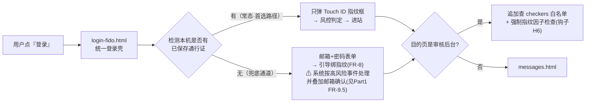

# Part 2 · 总体架构与模块边界

> 状态：🚧 待项目负责人确认
> 前置阅读：[01-需求定义.md](./01-需求定义.md)
> 读者提示：本文回答两个问题——**这个新模块长什么样（文件形态）、它如何以最小代价嵌进旧站**。"可插拔"三个字在这里落成具体承诺。

---

## 1. 先看清要嵌入的宿主环境（对现状的三个关键复述）

| 宿主特点 | 对模块设计的直接影响 |
|---|---|
| 无构建工具：每个页面一个 HTML，内联 `<script>` | 模块不能是 npm 包或框架组件，只能是**普通 js 文件 + 普通 html 页面**，用 `<script>` 引入即用 |
| 认证全部走浏览器内的 supabase-js | 模块不推翻密码体系，而是**包在 supabase-js 外面**（包装器思路），下层账号数据完全沿用 |
| 页面守卫是"各页内联的重复代码"（initAuth/checkAuth） | 现成的重复恰是插入点：把守卫逻辑升级为"守卫 + MFA 门槛检查"，改动集中在几行调用 |

已知确切挂钩点（来自现状分析，精确到文件与位置语义）：

| # | 文件 | 位置 | 作用 |
|---|---|---|---|
| H1 | `login.html` | `signInWithPassword` 成功回调处（约第 80–93 行） | 密码登录后 → 接入风控判定与跳转 |
| H2 | `login-messageschecker.html` | 同类回调 + checkers 表二次校验处（约第 85–113 行） | 审核员登录同上 |
| H3 | `register.html` | 表单提交处理处（约第 109 行 signUp 调用前后） | 学校邮箱域拦截 + 一次性手机验证插桩 |
| H4 | `messages.html` | 发帖提交处理处 + 编辑框区域 | FR-8 互动门槛的置灰与拦截 |
| H5 | `details.html` | 回复/评论提交处理处 | 同上 |
| H6 | `checker-pending/approved/deleted.html` | 各自的 `checkAuth()` 函数体尾部 | 追加"审核员强制指纹因子"检查（FR 决策 A） |
| H7 | `header.html` / 各页面头部 | 头像下拉菜单 | 新增"安全中心"菜单项入口 |

---

## 2. 模块文件形态（可插拔的三件套）

```
isaspectrum/                      ← 将来的部署站点根目录
├── （原有页面一律不动……）
├── login.html                    ← 仅改：引脚本 + 1 行钩子
├── register.html                 ← 仅改：引脚本 + 2 行钩子
├── messages.html / details.html  ← 仅改：引脚本 + 门槛调用
└── mfa/                          ★ 全部新增物集中在此目录（拔走=删目录）
    ├── mfa.config.js             ← 域名白名单/短信/风控参数/总开关
    ├── mfa.js                    ← 前端 SDK：对外仅暴露 window.ISAMFA 一个对象
    ├── enroll.html               ← 绑定指纹引导页
    ├── security-center.html      ← 安全中心（设备列表/恢复码管理/手机号展示）
    ├── recover.html              ← 恢复流程页（恢复码/挂起）
    ├── register-phone.html       ← 注册期一次性手机验证插页
    └── login-fido.html           ← 统一登录页壳（见 §4）
```

服务端部分不在站点目录里，而在 **Supabase Edge Functions** 中随项目独立部署（类比：你嵌入式世界里 MCU 主程序旁边跑在云端的小协处理器；它的代码属于本项目仓库，但不进静态站目录）。数据表沿用同一个 Supabase 项目新增若干张（Part 5 定义）。

## 3. 总体架构图

```mermaid
flowchart TB
    subgraph HOST["宿主站点（原文件 · 改动以"+"标注）"]
        LOGIN["+ login.html<br/>钩子H1"]
        REG["+ register.html<br/>钩子H3"]
        MSG["+ messages.html<br/>钩子H4"]
        DET["+ details.html<br/>钩子H5"]
        CHK["+ checker 三页<br/>钩子H6"]
    end

    subgraph MODULE["mfa/ 可插拔模块"]
        SDK["mfa.js（window.ISAMFA）<br/>WebAuthn 编排 · 风控调用 · UI 卡片渲染"]
        CFG["mfa.config.js<br/>域名白名单 / 风控参数 / 总开关"]
        PAGES["enroll / security-center /<br/>recover / register-phone / login-fido"]
    end

    subgraph SERVER["Supabase 项目（扩展区）"]
        subgraph NEW["★ 本模块新增"]
            EF["Edge Functions ×~8<br/>webauthn 与OTP的后端实现<br/>（simplewebauthn 库承载）"]
            TBL["新表：webauthn_credentials<br/>recovery_codes · phone_bindings<br/>risk_events（详见 Part 5）"]
        end
        subgraph OLD["原有（不动）"]
            AUTH["Auth(GoTrue) 会话体系"]
            DATA["messages 等业务表"]
        end
    end

    HOST -->|"引 script + 调钩子"| SDK
    PAGES -.->|"加载"| SDK
    CFG -->|"读取参数"| SDK
    SDK <-->|"fetch 调用"| EF
    EF --> TBL
    EF <-->|"签发/校验会话（桥接机制，Part 3详解）"| AUTH
    HOST <-->|"业务读写照旧"| DATA
```

要点：

- **鉴权分两层继续成立**：Supabase 的 RLS（数据库层的规则防火墙，类比：就算有人绕过前台直闯库房，库房门口还有一道门禁）原样保留；模块在其前面加的是"进门方式"与"进门后能干什么的策略层"。
- **模块对宿主的唯一影响面 = 表格里那 7 个挂钩点**。不存在"修改整站代码"这种事。

## 4. 登录入口整合方案（解释 H1/H2 为何收敛为一个壳）

现状有用户登录页和审核员登录页两套几乎相同的代码。模块化后统一为一条链路：



旧的 `login-messageschecker.html` 保留但内容退化为"一行跳转到统一壳"——保证老链接和收藏夹不断掉。

> **等级序提醒**（源自 Part 1 总原则）：上图两条路径的定位不对等——指纹是首选兼底线的强通道，密码表单只是"设备上还没有通行证"时的兜底弱通道，走它本身就会触发额外确认，且审核员后台永远只认通过指纹验证的会话。风控升级时不会出现"刷完指纹再输密码"的反向逻辑。

## 5. 对外契约：宿主能向模块要什么（`window.ISAMFA`）

这就是"可插拔"的文字版协议。宿主页面对模块的全部认知就这一个对象：

| 方法 | 给谁用 | 行为 |
|---|---|---|
| `ISAMFA.init(pageRole)` | 所有引脚本的页面 | 读配置、装配 UI、预取用户 MFA 状态 |
| `ISAMFA.login()` | 登录页 | 执行完整登录编排（指纹优先/密码兜底/风控升级），返回标准会话 |
| `ISAMFA.beginEnrollment()` | 绑定页 | 引导 Touch ID 绑定全流程 |
| `ISAMFA.interactionStatus()` | messages/details（H4/H5） | 返回 `{allowed: bool, reason}` 供置灰/放行 |
| `ISAMFA.checkerGate()` | checker 三页（H6） | 审核员强制因子检查，未通过则接管页面引导绑定 |
| `ISAMFA.openSecurityCenter()` | 头像菜单（H7） | 打开安全中心 |
| `ISAMFA.status()` | 任意 | 只读状态快照，供调试与页面显示 |

**总开关契约**（NFR-3 一键回退）：当 `mfa.config.js` 中 `ENABLED:false` 时，以上方法全部退化为空操作直通（`interactionStatus()` 恒允许、`checkerGate()` 恒通过、登录走原始密码路径）。也就是说：宿主代码**写了钩子之后可以永远不再改**，开关决定行为。

## 6. 边界确认清单（防止越界）

- ✅ 归模块管：注册插桩、认证方式、风控、互动资格、安全中心、恢复。
- ❌ 不归模块管：留言 CRUD、审核流转、通知内容本身、样式重构——一概不动（需要通知发消息时，模块只是往现有 notifications 表**写一条记录**而已）。
- ⚠️ 单向依赖约定：`mfa/ → 宿主` 只允许"读"（比如取当前用户）；宿主 `→ mfa/` 只通过上表 API。杜绝双向纠缠导致拆不下来——这是"插件"区别于"胶水补丁"的分水岭。

---

## 下一步

Part 3 将论证为什么不直接用 Supabase 内置 MFA、WebAuthn 服务端选型（simplewebauthn 开源库），以及最关键的"会话桥接"机制——上面架构图里那条虚线到底是什么。
