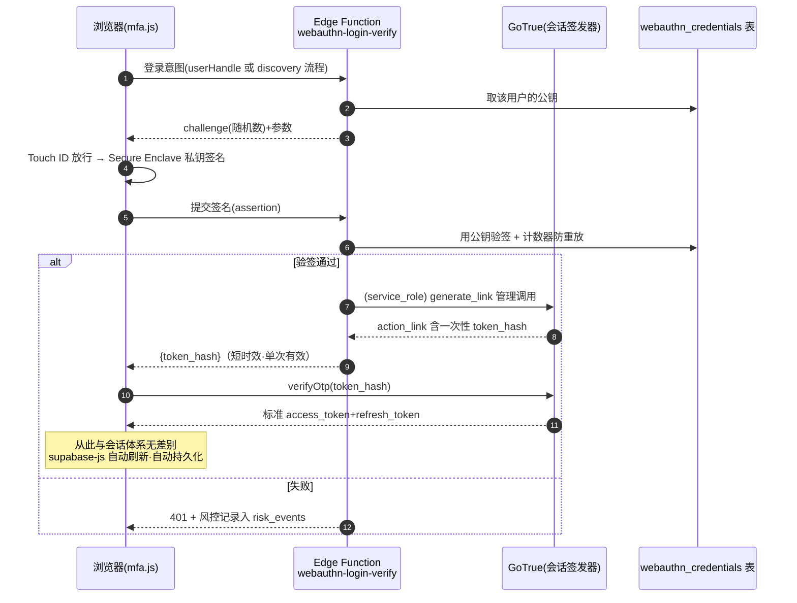

# Part 3 · 技术选型与论证

> 状态：🚧 待项目负责人确认
> 前置阅读：[02-架构与模块边界.md](./02-架构与模块边界.md)（本章展开其 §3 架构图中的服务端扩展区，以及那条"会话桥接"虚线）
> 读者提示：本章是全系列技术密度最高的一篇，但所有概念都会给嵌入式类比。

---

## 1. 为什么不直接用 Supabase 自带的 MFA？

现状分析时发现，我们寄宿的 Supabase 平台其实**自带了一层 MFA 能力**（GoTrue 的 `mfa.enroll/challenge/verify` 端点）。它支持的因子只有两种：

| 官方自带因子 | 为什么不适合本项目 |
|---|---|
| TOTP 动态口令（手机上的验证器 App 生成 6 位数字） | 验证器 App 装在手机里——而学生在校内不方便使用手机，恰恰把最强日常因子锁在了最不可用的设备上 |
| SMS 短信验证码 | 同上，且运营商延迟、费用、境外号码问题；FR-2 已明确短信只做注册首验 |

**关键缺口：官方 MFA 不支持 WebAuthn/平台认证器**——没有 Touch ID 这条路。因此结论是自建 WebAuthn 层。好消息是：① WebAuthn 是浏览器原生标准，MacBook 上**零安装**（Safari/Chrome 内置支持）；② 服务端验证有成熟开源库可复用，不需要手写密码学。

## 2. 三分钟看懂 WebAuthn（嵌入式视角）

把整套机制想象成一次**设备配对握手 + 挑战应答**：

- **注册（绑定）时**：网站说"请自造一对钥匙"，MacBook 在 Secure Enclave 安全芯片里生成私钥并保存（私钥永远不出芯片，类比固件里的 OTP 存储区），把公钥交给服务器存档。
- **登录时**：服务器发一个随机数（挑战，challenge）说"用你的私钥签这个"；芯片要求用户先按指纹才允许动用私钥；签名交回服务器，用当初存的公钥验签。签名内容包含这次挑战值，所以截获了也不能重放。
- **两道天然防线**：
  1. **域名绑定（rpID）**：私钥的使用被硬件限制在"和绑定域名一致的网页"里。钓鱼站域名不同 → 设备拒绝签名。这是密码永远做不到的"物理免疫钓鱼"。
  2. **物理在场证明**：指纹校验发生在设备本地，保证"拿得到电脑的人之外没人能触发签名"。数据库整个泄露也偷不走任何可用凭证。

> ⚠️ 一个必须趁早做的决策：**rpID 锁定正式运营域名**。通行证与域名终身绑定（参考站已经历 `pages.dev → celestivast.com` 的迁移，教训现成）。若日后换根域名，全站已绑定的通行证全部作废，所有人重新走恢复流程。本设计默认 **rpID = `celestivast.com`**（裸域），其子域名均可使用同一批通行证。

> 另一柄双刃剑要向你如实交代：macOS 的通行证可通过 iCloud 钥匙串同步到同账号的其他苹果设备。好处是换新 Mac 时旧通行证自动跟过来（FR-6.2 场景变轻松）；代价是"每台设备一把独立钥匙"的严格性被稀释（一台 Apple ID 被攻破波及多台）。默认策略：**接受同步**，但数据表里记录每条凭据是否为同步来源，管理员可在安全中心看到并单独吊销。

## 3. 组件选型表

| 层 | 选型 | 版本/形态 | 选择理由 & 落地形态 |
|---|---|---|---|
| 服务端验证库 | **@simplewebauthn/server** | Deno 兼容，MIT 协议 | WebAuthn 领域事实标准库：负责生成/校验注册与登录时的加密挑战包。跑进 Supabase Edge Functions（Deno 运行时）无需改动 |
| 浏览器辅助 | @simplewebauthn/browser | jsDelivr CDN 引入 | 封装 `navigator.credentials` 调用细节，与我们"无构建工具"约束兼容（ESM 直接 import） |
| 服务端运行环境 | Supabase Edge Functions（Deno） | 已有平台附加能力 | 无需租服务器；函数级隔离；天然走 HTTPS |
| 数据库 | 同项目 Postgres 新增 5 张表 | Part 5 定义 | 与业务数据同库同 RLS 体系 |
| 注册短信 | 腾讯云 SMS REST API | 决策 C | Edge Function 内直接 HTTPS 调用，供应商封装成接口类便于替换 |
| 前端 SDK | 自研 `mfa.js`（纯 vanilla JS） | — | 无构建工具约束下唯一合理选择 |
| 会话体系 | 复用 GoTrue（见 §4） | supabase-js v2 现有版本即可 | RLS 依赖其 JWT 结构，绝不能换掉 |
| ❌ 不引入 | React/Vue/npm 工具链、独立认证服务器(Auth0 等) | — | 违反零侵入约束 / 引入新的信任方与费用 |

## 4. 核心难题：会话桥接（架构图里的那条虚线）

### 问题陈述

Supabase 只认自己签发的会话票（JWT）。而我们现在是**自己的 Edge Function 完成 WebAuthn 验签**——验完了，凭什么让用户拿到一张"正版车票"进入既有会话体系？

### 方案对比

| 方案 | 做法 | 判定 |
|---|---|---|
| A：管理端造票兑换 | Edge Function 用 service_role 密钥（最高权限，只存在于服务端）调用 GoTrue 管理接口为目标用户生成一次性魔法链接票据，取回其中的 token_hash 交还浏览器，浏览器端用 supabase-js 的 `verifyOtp({token_hash})` 兑换成标准会话 | ✅ 采用：全过程 HTTP 无明文秘密出服务器侧，得到的票与正常登录**完全同构**，RLS 全兼容 |
| B：自签 JWT 顶替 | 自己造一套 JWT 注入客户端 | ❌ 否决：JWT 格式对不上 GoTrue 签名，等于推翻 RLS 重装修整栋楼，违背零侵入红线 |
| C：本地假装登录（存储伪造 session 对象） | 手工拼 localStorage | ❌ 否决：脆弱且本质是伪造，令牌刷新立刻穿帮 |

### 采用方案 A 的完整时序

工程注意点（将在 Part 5 细化）：token_hash 单次有效由 GoTrue 天然保证；Edge Function 对同一用户做限速防爆破；桥接事件本身写审计日志。

## 5. 明确否决路线一览（防止将来被"是不是更简单"诱惑）

| 路线 | 否决理由摘要 |
|---|---|
| Supabase 原生 TOTP/SMS 因子 | §1 已述：设备可用性倒挂；与 FR 冲突 |
| 第三方认证云（Auth0/Clerk） | 引入外部信任方、按月费、迁移老账号成本高；收益为零因为核心需求(Safari Touch ID+自定风控)仍要自建大半 |
| 纯前端"假安全"方案（如指纹后仅本地标记免登录） | 本质是把开关存在 localStorage——改一行脚本即被绕过，属于安防装饰品而非安防器件 |
| 让学生装公司 SSO 客户端 | 校园场景过度工程 |

---

## 6. 对既有文档的反向影响核查

- API 契约（Part 2 §5）：无变化——桥接发生在 `ISAMFA.login()` 与各流程内部。
- 需求文档（Part 1）：无变化——FR 均与本方案的实现解耦。
- 新增待办移交 Part 5：数据表需增加"凭据同步来源标记""bridge 事件日志"两类字段。

**下一步预告**：Part 4 把以上所有机构拼起来，画出全部流程时序图（注册/首绑引导/指纹直登/兜底密码通道/恢复码/换机/盗号挂起），逐条对照 FR 编号验收。
