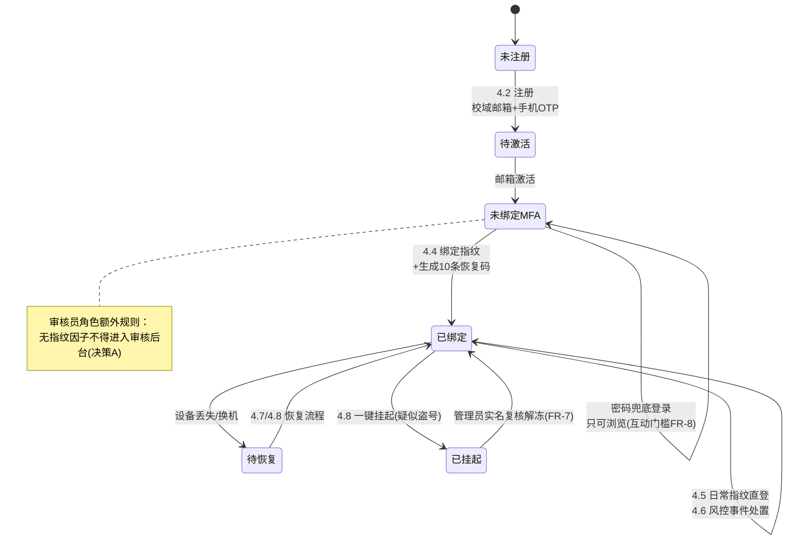
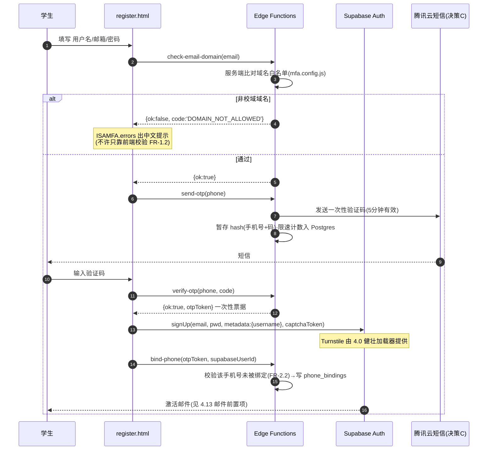
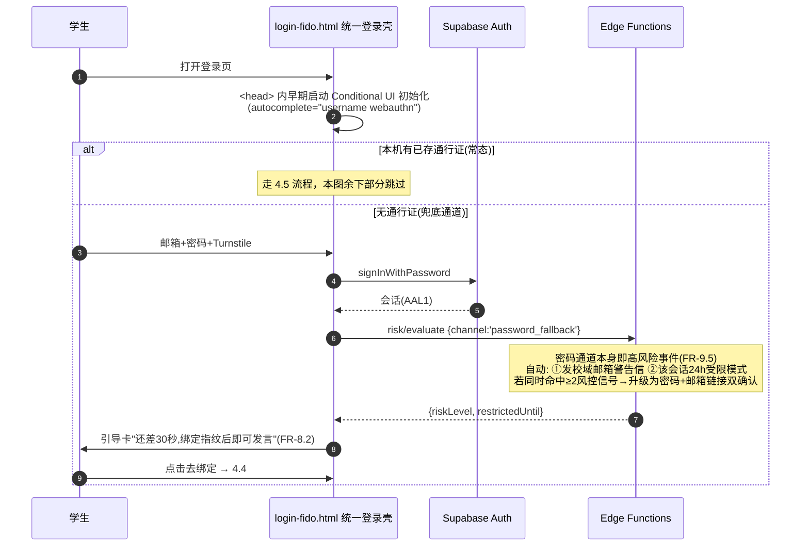
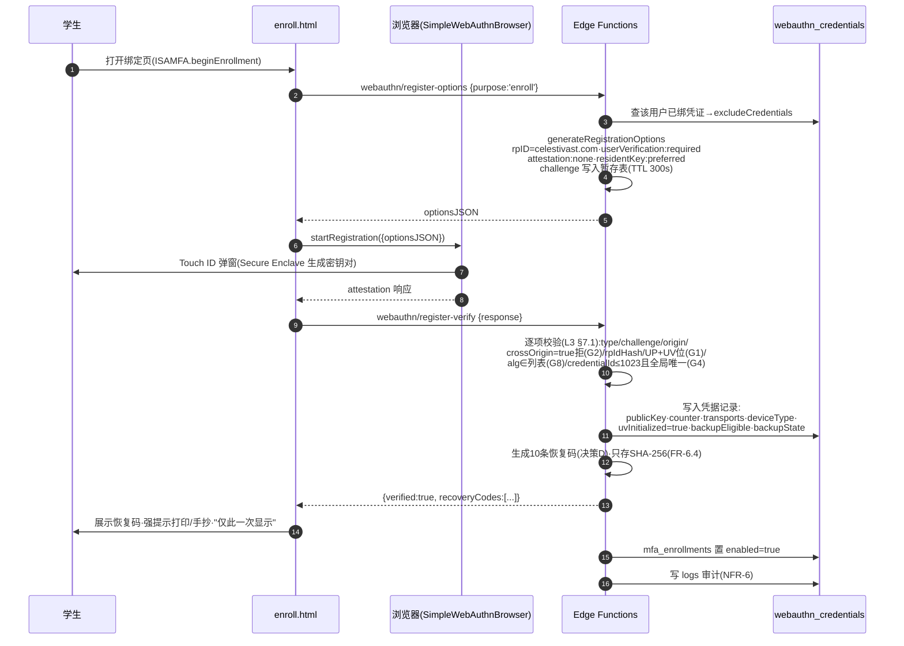
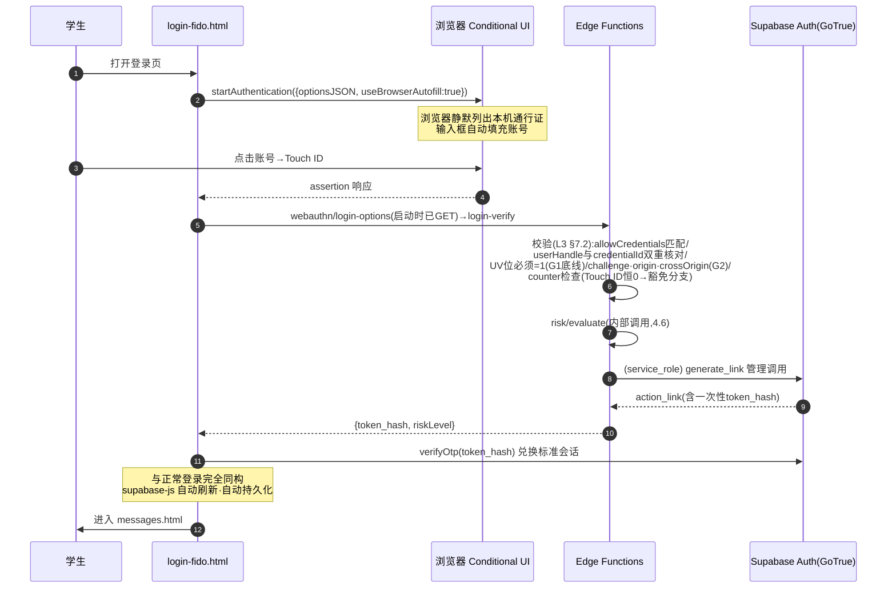
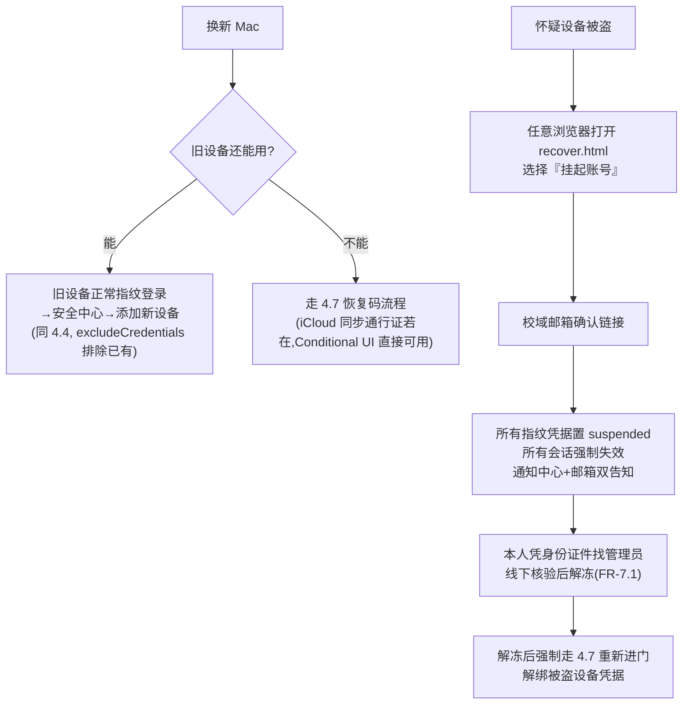

# Part 4 · 核心流程设计

> 状态：🚧 待项目负责人确认
> 前置阅读：[02-架构与模块边界](./02-架构与模块边界.md)、[03-技术选型](./03-技术选型.md)、[spec-webauthn-核心概念与实现要点](./spec-webauthn-核心概念与实现要点.md)（本文引用其 G1–G8 缺口编号）
> 读者提示：每个流程图旁标注了它满足的需求编号（FR-xx / 决策 A–E）与规范缺口（G#）。术语沿用 W3C 文档的中文译法。

---

## 4.0 设计总则（所有流程的共同前提）

1. **等级序铁律**（决策 E）：指纹通行证是首选兼底线因子；密码只是兜底通道；**任何流程都不得出现"刷完指纹再验密码"**。风控升级用"附加独立核验/收紧权限"实现，不用密码复核。
2. **所有 WebAuthn 验签都在服务端**（Edge Functions），前端只做浏览器 API 编排——旧站"客户端守卫=装饰"的教训以架构方式根治。
3. **挑战生命周期**：服务端生成（≥16 字节熵）→ `webauthn_challenges` 表暂存 → 5 分钟 TTL（规范推荐 300000ms，G7）→ 单次验证后销毁。
4. **本模块页面集（mfa/）全部带 CSP 响应头**（G6，`_headers` 按路径匹配）；限制第三方脚本 = 只允许 Turnstile 与 simplewebauthn browser 两个来源。
5. **统一错误字典**（线上问题 3 的修复落位）：所有 Edge Function 返回 `{ok:false, code}`，前端经 `ISAMFA.errors.translate(code)` 出中文文案；raw 错误只进 console。
6. **健壮验证码加载器**（线上问题 2 的修复落位）：本模块页面的 Turnstile 用显式渲染 + `retry:'auto'` + onerror 重试 UI；宿主页（login/register）由钩子代码替换为同一加载器。

## 4.1 用户生命周期总览

## 4.2 注册流程：校域邮箱 + 一次性手机验证（FR-1/2/3，钩子 H3）

要点：手机号验证完成后**只存档案、永不参与登录**（FR-2.1）；页面展示永远只露尾四位（FR-2.3）；线下核验备选通道由管理员在安全中心手工标记（FR-2.4）。

## 4.3 密码兜底登录 + 首次绑定引导（FR-8/FR-9.5，钩子 H1）

强制规则：此路径产出的会话标记 `restricted_until=now()+24h`，期间改密/绑新设备/用恢复码需额外独立核验（FR-9.2 矩阵）；**绝不反问密码**。

## 4.4 指纹绑定（FR-4，uvInitialized 建立，G1）

要点：绑定成功即解除互动门槛（FR-8.3 实时生效）；同一 Mac 的每个浏览器可共享设备级密钥（FR-4.3，实现按 simplewebauthn 文档择优）；BE=0 的单设备凭据在安全中心提示"建议再加一把或记住恢复码"（G3）。

## 4.5 日常指纹直登（FR-5.1，常态体验，含会话桥接）

要点：bridge 票据只签发给发起验证的同一会话上下文（fail-closed 借鉴，Passkey-2fa 纪律）；限速用 Postgres 共享计数而非函数内存。

## 4.6 风控判定与升级（FR-9）

| 命中信号（第一期最小集） | 判定 | 处置 |
|---|---|---|
| 0 项 | 常态 | 直接进站 |
| 设备指纹首次出现（本账号从未用过此设备） | 中 | 指纹通过后弹一句确认"这是你本人的操作吗？" |
| 校外网络 / 凌晨1–5点首次使用 | 中 | 同上 |
| 24h 内发生过恢复码使用/解绑/挂起 | 高 | 指纹**必须首先通过且不可跳过**（底线）；通过后进入 24h 受限模式：可浏览发言，敏感操作需学校邮箱确认链接或恢复码 |
| 密码兜底通道（无论信号数） | 高 | 自动邮箱警告 + 24h 受限模式（4.3） |

规则：所有参数入 `mfa.config.js` 可调（FR-9.3）；每次判定写 `risk_events`（FR-9.4）；审核员账号任何通道进入审核台都要求有效指纹因子并通过 UV（FR-9.6，决策 A）。

## 4.7 恢复码流程（FR-6.1/6.2/6.4/6.5）

- **使用**：recover.html → 输入邮箱 → 请求校域邮箱确认链接（ possessions 因子）→ 邮件落地页粘贴任一未用恢复码（knowledge 因子）→ 双因子齐 → 服务端核验 hash → 生成 bridge 票据兑换会话 → **强制**进入 enroll 页绑定新指纹 → 完成后自动撤销同批次其余恢复码并重发新一批 10 条（FR-6.2 "进门后立即撤销旧码"）。
- **提示**：安全中心常显剩余可用数；<3 条黄条提醒重新生成（FR-6.5）；重新生成=旧批全部作废+新批生成+logs 记录。
- **限速**：恢复码尝试错误计入共享限速表（连续 5 次错 → 该账号 30 分钟冻结恢复入口）。

## 4.8 设备丢失/换机与一键挂起（FR-6.3，G3）

## 4.9 解绑设备与认证器同步（G5）

安全中心 → 设备列表（显示绑定时间/设备类型/是否 iCloud 同步来源）→ 解绑（强验证：指纹会话 + 敏感操作核验）→ 服务端删凭据行 → **调用浏览器 `signalUnknownCredential` 通知本机认证器移除残影**——否则该通行证仍出现在 Conditional UI 选项里，选中即报错（规范正解）。

## 4.10 审核员强制门禁（决策 A，钩子 H6）

checker 三页的 `checkAuth()` 尾部追加 `await ISAMFA.checkerGate()`：无有效指纹因子 → 接管页面渲染绑定引导卡，不加载任何审核数据；密码登录会话即使存在白名单行也**不得**进入（FR-9.6）。旧登录页退化为一行跳统一壳（H2）。

## 4.11 管理员兜底通道（FR-7）

三类操作（手工标记手机验证 / 解绑与解冻 / 重置恢复码）统一在 security-center 管理视图，全部写 logs（复用现有表模式）并向学生通知中心推送"管理员执行了什么"（FR-7.2）。

## 4.12 互动门槛拦截（FR-8，钩子 H4/H5）

messages/details 页初始化时调 `ISAMFA.interactionStatus()`：未绑定 → 发帖框/评论框置灰 + 引导卡（可看不可说）；绑定后状态实时生效，无需刷新。门槛检查同时服务端兜底：发帖写入路径校验 `mfa_enrollments.enabled`，防止绕过前端直接调 REST（旧站审计 H-2 的教训内化）。

## 4.13 邮件送达率前置项（线上问题 1 的落位）

本模块依赖校域邮箱的三处流程（激活/恢复确认链接/高危操作核验）**全部以"邮件可达"为前提**。前置项：站主完成 DKIM 开启 + DMARC 升级（或改事务邮件服务+独立子域）方可上线；开发期用"恢复码/管理员通道"双路径保证邮件故障时恢复流程不断（4.7 的恢复码单独也能过邮箱链——设计冗余）。
