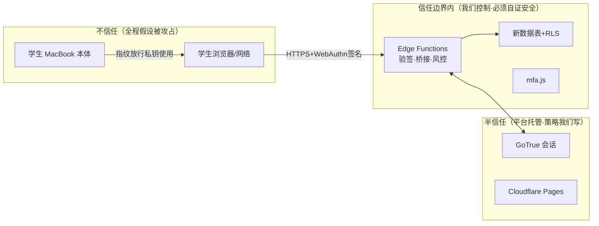

# Part 6 · 威胁模型与安全清单

> 状态：🚧 待项目负责人确认
> 输入来源：[安全审计报告](./audit-2026-08-27-安全审计报告.md)（H/M/L/I 全部编号）、[W3C L2/L3 规范要点](./spec-webauthn-核心概念与实现要点.md)（G1–G8）、[技术要点清单](./tech-webauthn-实现要点清单.md)、运营风险分析（2026-08-28 对话）
> 性质：本文是全项目的**安全验收标准**——Part 7 每个里程碑完成时对照本文逐条打钩。

---

## 一、资产与信任边界

核心立场（继承审计 H-2 教训）：**浏览器端代码永远按"已被完全读懂并可能被绕过"设计**；一切安全判断只存在于 Edge Functions 与 RLS。

## 二、攻击者画像（校园场景，威胁建模从画像出发）

| 画像 | 能力 | 动机 | 主攻路径 |
|---|---|---|---|
| A·好奇同学 | 低；会用 F12、会装插件 | 恶作剧、删他人留言 | 撞库密码、捡到未锁电脑、冒用恢复码 |
| B·校外针对性攻击者 | 中；钓鱼页、撞库库、社工 | 冒名发布损害他人名誉内容 | 钓鱼密码（WebAuthn 物理免疫）、买通凭据 |
| C·物理接触者 | 能拿到未锁定的 MacBook | 查看冒发内容 | 触碰即用已解锁会话 |
| D·内部越权者 | 合法审核员账号 | 越权删改 | 无指纹因子时段的旧会话 |

## 三、攻击面逐项对策（STRIDE 化简 · 每条注明设计与验收位置）

| # | 威胁 | 对策（设计落点） | 验收判据 |
|---|---|---|---|
| S1 | 密码钓鱼/撞库冒充登录 | WebAuthn rpID 域名绑定：钓鱼域≠`celestivast.com` 设备拒绝签名（Part 3 §2）；密码通道降格兜底+邮箱警告+24h受限（4.3） | 钓鱼域测试：浏览器在假域发起 create/get 必然 NotAllowedError |
| S2 | 重放截获的签名 | challenge 服务端生成≥16字节熵、暂存、TTL 300s、单次销毁（4.0 总则3，G7） | 同一响应体二次提交必须 401/CHALLENGE_EXPIRED |
| S3 | 假指纹——只到"在场"不到"验证" | 服务端强制 UV 位=1（G1）；uvInitialized 生命周期管理 | UV=0 的 assertion 被服务端拒绝（虚拟认证器可构造） |
| S4 | 凭据克隆 | counter 单调性检查（Touch ID 恒 0 豁免分支，spec §三） | counter 回退样本触发拒绝+告警 |
| S5 | 会话票据窃取 | bridge 票据 fail-closed 绑定会话上下文；票据 5min 单次；JWT 仍走 GoTrue 原生刷新 | 抓包 token_hash 在他处 verifyOtp 必失败 |
| T1 | 篡改风控/门槛判定 | interactionStatus 仅供 UI；写入路径服务端复验 mfa_enrollments.enabled（4.12） | 绕过前端直打 REST 发帖：未绑用户被 RLS/服务端拒绝 |
| T2 | 篡改凭证表 | credentials/recovery/challenges/risk 四表 RLS 全拒默认，仅 service_role 写（Part 5 §二） | anon key 直打四表：全部空数组/401 |
| R1 | 管理员抵赖 | 全部兜底操作写 logs+通知学生（FR-7.2） | 任一解绑/解冻在 logs 与学生通知中均可对账 |
| I1 | 数据库泄露换得可用凭据 | 私钥不出 Secure Enclave；恢复码只存 SHA-256；手机号只存 hash+尾四位 | 泄露字段清单核对（Part 5 注释） |
| I2 | 账号枚举/探测 | 登录错误统一文案；注册邮箱已存在时的文案策略；恢复页不区分"无此账号/码错"（校园场景低危，低成本顺带做） | 错误响应文本审计 |
| I3 | 通知 XSS（继承审计 I-3/旧站 notify 原始 HTML） | 模块自有通知一律 escapeHtml+白名单模板；不改旧站通知渲染（边界外提示站主） | 恶意昵称/内容注入测试 |
| D1 | OTP/恢复码/登录爆破 | Postgres 共享限速（Part 5 rate_limits）：登录 10次/15min/IP、恢复码 5次/30min/账号、OTP 5条/24h/号 | 超限返回 RATE_LIMITED 且持续窗口 |
| D2 | Turnstile/邮件不可达致流程死锁 | 健壮加载器+重试（4.0）；恢复码可不依赖邮箱单独完成进门（4.7 冗余设计） | 断网模拟 Turnstile 失败：可重试不卡死 |
| E1 | 越权进审核台 | checkerGate：无 UV 会话一律接管（决策A/FR-9.6）；服务端审核操作同样校验指纹会话标记 | 密码会话调审核 API：403 |
| E2 | 凭据抢注（受害者 ID 重复注册） | credentialId ≤1023B + 全局唯一（G4） | 重复 ID 注册被拒 |
| E3 | iframe 嵌入滥用 | crossOrigin=true 一律拒绝；CSP frame-ancestors 'none'（G2+G6） | 构造 iframe 调用：被拒 |

## 四、模块自身交付标准（编码期逐条验收）

1. **前端零秘密**：mfa/ 与页面源码中不得出现 service_role、腾讯云 SecretId/Key——只允许出现公开 anon key 与 Turnstile sitekey。CI 可 grep 检查。
2. **mfa/ 页面集 CSP**（G6）：Part 5 §五的 `_headers` 追加块生效，wrangler pages dev 验证。
3. **浏览器依赖 SRI**：simplewebauthn browser UMD 带 integrity 属性，版本锁死。
4. **fail-loud 冷启动断言**（Passkey-2fa 纪律）：Edge Function 启动时校验 rpID/origin/secret 齐全且 origin https，缺失即显式报错拒绝服务。
5. **统一错误字典**：对外响应只有 `{ok, code}`，raw 堆栈只进服务端日志（线上问题 3 闭环）。
6. **审计完备**（NFR-6）：enroll/unbind/recovery_used/suspend/unsuspend/admin_* 全部落 logs；留存 ≥1 学年。
7. **一键回退**（NFR-3）：`ENABLED:false` 全链路直通；上线前演练一次回退。

## 五、未成年人合规节（新增强制项）

- **隐私政策上线前置**：本模块引入手机号（hash）与风控行为数据，等于加重处理未成年人个人信息——隐私政策（收集范围/目的/保留期/家长须知）必须在 MFA 灰度前发布，且注册页首次勾选确认。归属：站主起草、本项目提供数据清单（Part 5 全部字段即清单）。
- **数据最小化复核**：对照 Part 5 七张表逐字段过一遍"能否不收集"——已按最小化设计（无姓名证件、hash 存储），保留期：risk_events 1 学年后聚合清理；webauthn_challenges/otp_tokens 24h 定时清理。
- **删除权路径**：注销账号（若站方未来提供）级联删除七张表（FK on delete cascade 已内建）。

## 六、平台层前置检查（继承运营风险分析，M0 门禁）

| # | 项 | 不做的后果 | 负责方 |
|---|---|---|---|
| P1 | **域名自动续费** | rpID 根基消失=全校通行证作废 | 站主（MFA 上线硬门禁） |
| P2 | **Supabase 档位确认+用量告警** | 免费档假期暂停=死站，恢复流程同时瘫痪 | 站主 |
| P3 | **邮件认证链整改**（DKIM/DMARC 或事务邮件服务） | 恢复/警告信进垃圾箱=恢复体系降级 | 站主（4.13 前置项） |
| P4 | **SW 缓存策略修正**（'/' 永久陈旧 + 版本号自动化） | 改版不可达；MFA 页面可能被旧缓存吞掉 | 本项目顺带修复（在 mfa 模块交付内，改动仅 sw.js 数行） |
| P5 | **最小监控**（Supabase 自带告警 + 免费uptime监控） | 故障靠学生口传发现 | 本项目顺带配置 |
| P6 | **隐私政策发布** | 合规裸奔加重 | 站主起草/本项目供清单 |

## 七、残余风险声明（明确接受、不假装解决）

1. **Touch ID counter=0**：macOS 平台认证器不提供克隆检测——接受（spec 原生限制，counter 防线对安全钥匙仍有效）。
2. **iCloud 钥匙串同步稀释"一机一钥"**：Apple ID 被攻破波及同步凭据——接受但记录 is_sync_source 可单独吊销（Part 3 决策）。
3. **物理胁迫/肩窥**：有人拿已解锁的 Mac 操作——WebAuthn 无解，靠 C 画像下的"挂起+管理员复核"兜底。
4. **设备恶意软件**：本机被植入键盘记录/会话劫持——超出本模块边界，凭会话短时限与受限模式止损。
5. **RLS 依赖既有业务表策略正确**：我们只保证新表策略显性化；messages 等旧表策略仍属站主责任（已提供实证探测方案）。
