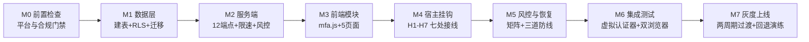

# Part 7 · 实施路线图

> 状态：🚧 待项目负责人确认
> 前置阅读：[06-威胁模型与安全清单](./06-威胁模型与安全清单.md)（每个里程碑的验收判据来自 Part 6 清单与 Part 1 §5 验收表）
> 读者提示：里程碑按依赖排序，标注了每步需要的工具（对照工具链对话）与"谁做"（我=ZCode 编码执行，你=决策/提供凭据，站主=平台侧整改）。

---

## 里程碑总览

## M0 · 前置检查（门禁，不写业务代码）

| 任务 | 谁 | 产出 |
|---|---|---|
| Docker/Node 安装，`deno≥1.43`、`supabase` 版本核对 | 你 | 环境就绪 |
| 腾讯云短信开户+签名/模板申请（审核 1–3 工作日，**最先启动**） | 你/站主 | 短信通道凭据（开发期可先用模拟） |
| 域名自动续费 + Cloudflare 控制权确认（P1） | 站主 | DNS/Pages 操作权 |
| Supabase 档位确认+告警（P2）、邮件 DKIM/DMARC 整改启动（P3） | 站主 | 平台可靠性 |
| 隐私政策起草启动（P6，与 M7 并行推进即可） | 站主（我供数据清单） | 合规文档 |
| 仓库骨架：`supabase init` + 站点目录 + `design/` 并入仓库 | 我 | 可提交的工程底座 |
| **sw.js 缓存修正 + uptime 监控**（P4/P5，唯一动宿主文件的非挂钩改动） | 我 | 运营债清偿 |

**门禁判据**：M0 未全绿不开 M7 上线（M1–M6 可并行推进不受阻）。

## M1 · 数据层

- 七张表迁移 SQL（Part 5 §一）入库为 `supabase/migrations/`，本地 `supabase db reset` 一键重建。
- RLS 策略按 Part 5 §二落地；**用 anon key 逐表实测"全拒默认"**（顺手完成审计 H-2 的实证模板）。
- seed 脚本：测试账号 ×3（普通/审核员/管理员）+ 假手机绑定。
- **判据**：每张表策略与文档逐条一致；`supabase db diff` 无漂移。

## M2 · 服务端（Edge Functions ×12 + 内部端点）

- 按 Part 5 §三契约逐端点实现；simplewebauthn/server 走 JSR；fail-loud 冷启动断言（交付标准 4）。
- 限速器（Postgres 共享计数）+ 定时清理任务（challenges/otp 24h）。
- 桥接端点（login-verify→generate_link→token_hash）**最先打通**——它是全链路风险最高的关节。
- **判据**：curl 逐端点过契约示例；错误码全部出自字典；G1/G2/G4/G8 检查项有对应单测（WebAuthn 样本向量取自 W3C L3 §16）。

## M3 · 前端模块（mfa/）

- `mfa.js`：7 个契约方法 + `errors` 字典 + 健壮 Turnstile 加载器；UMD+SRI 引入 browser 包。
- 五个页面：login-fido（`<head>` 早期 Conditional UI）、register-phone、enroll、security-center、recover。
- UI 遵守 NFR-4 话术规范；`mfa.config.js` 含 `ENABLED` 总开关。
- **判据**：本地 `wrangler pages dev` 下 CSP 生效；总开关演练回退（交付标准 7）。

## M4 · 宿主挂钩（H1–H7）

- 七处接线，每处 ≤3 行；旧 login-messageschecker.html 退化为一行跳转。
- messages/details 门槛置灰+引导卡；checker 三页 checkerGate 接管。
- **判据**：git diff 宿主文件改动行数合计 ≤30 行（可插拔性的量化证明）。

## M5 · 风控与恢复

- 风控矩阵 4.6（信号采集：设备指纹首见/网络/时段/敏感事件）+ risk_events 留痕。
- 恢复三道防线全流程（4.7/4.8）：恢复码进门→强制重绑→旧批作废；挂起→管理员解冻。
- **判据**：Part 1 §5 验收表 FR-6/FR-9 三行全绿。

## M6 · 集成测试（发布门禁）

| 场景 | 工具 |
|---|---|
| 注册→OTP→绑定→直登 全链路 ×2 浏览器（Safari+Chrome） | 本地栈 |
| 不按指纹/UV=0/counter 回退/crossOrigin=iframe/重放旧响应 | Chrome DevTools WebAuthn 虚拟认证器构造 |
| 恢复码 10 条一次性、第 11 次穷举限速、换机、挂起解冻 | 脚本化 curl+UI 混合 |
| 无指纹设备（无 Touch ID 环境）密码兜底+邮箱警告 | 虚拟认证器关闭平台选项 |
| `ENABLED:false` 回退后全站原行为 | 手工回归 |

- **判据**：Part 6 §三攻击面表 S1–E3 全部有"已验证"标记；Part 1 §5 验收表 7 行全绿。

## M7 · 灰度上线

1. **过渡公告两周期**（FR-8.3）：提前 14 天站内公告+引导学生绑指纹（绑定入口先开放、门槛后生效——**软启动顺序**：M7-1 先上绑定不受限 → M7-2 14 天后开启互动门槛）。
2. 灰度顺序：审核员强制（决策A）→ 一两个班级试点 → 全校。
3. 上线日 runbook：回退开关演练记录、监控面板、站主应急联系表（挂起/解冻人工通道）。
4. 上线后 30 天复盘：risk_events 分布调参（FR-9.3）、恢复码使用率、误拦反馈。

## 阶段依赖与并行建议

- M0 短信申请与 DKIM 整改是**外部等待**，第一天就发起；M1–M3 不依赖它们完成。
- 我可以 M0 当周即开工 M1（数据层），工具只差 Docker/Node 装好。
- 每个里程碑完成即向你演示（本地栈 + 虚拟认证器），确认后进下一个——延续分部汇报节奏。

## 估算（供参考，非承诺）

| 里程碑 | 相对工作量 | 主要不确定项 |
|---|---|---|
| M0 | 0.5 周（含外部等待） | 腾讯云审核时长 |
| M1 | 0.5 周 | — |
| M2 | 1.5 周 | 桥接端点与 GoTrue 行为对齐 |
| M3 | 1.5 周 | Conditional UI 跨浏览器细节 |
| M4 | 0.5 周 | — |
| M5 | 1 周 | 风控参数初值 |
| M6 | 1 周 | 样本向量构造 |
| M7 | 2 周+（两周期过渡） | 学生绑定率 |
