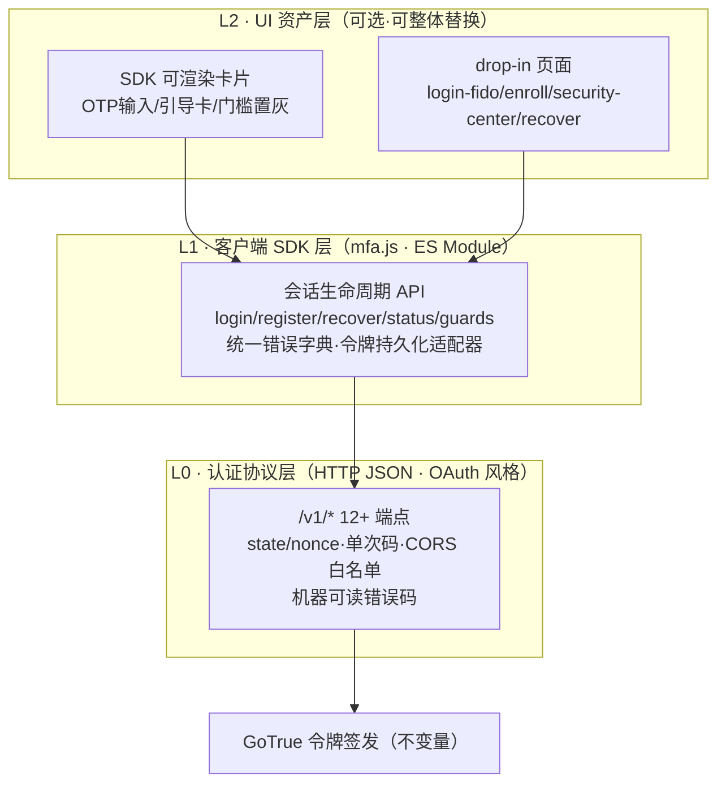
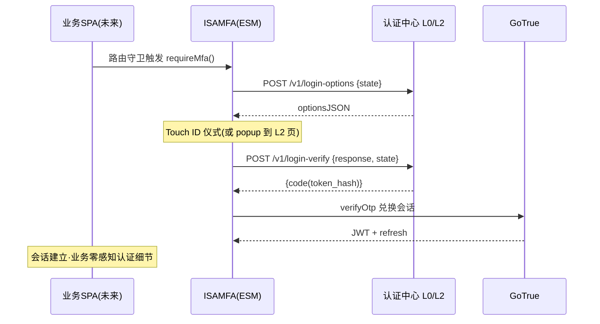

# Part 2 演进 · 三层契约（模块化产品级"可插拔"定义）

> 状态：🚧 待项目负责人确认
> 触发：项目负责人 2026-08-28 明确两项长期目标——① 模块不局限于 isaspectrum 单站，登录与业务互不影响、以"请求→返回"为唯一联系；② 业务板块必然重构为基于 JS 的动态网页（SPA）。
> 与已确认文档的关系：**不推翻 Part 1–7 任何结论**；将 Part 2 §5 的七方法契约升格为三层契约，并补充 SPA 集成画像。Part 2 §5 相应视为本文件的子集（L1 的静态站画像切片）。

---

## 一、动机重述与设计原则

| 你的要求 | 架构转译 |
|---|---|
| 登录模块与业务互不影响 | 两者的**唯一**耦合点是协议（HTTP）+ SDK（ES Module），不存在文件级、页面级引用 |
| 需要验证时发请求，模块返回结果 | 协议必须是**自描述、无页面上下文依赖**的：请求里不带"我来自哪个 html"的信息 |
| 业务将重构为 SPA | 集成方式必须对"多页静态"与"单页动态"一视同仁；挂钩方案（doc 08）只能是一种集成画像，不能是唯一画像 |
| （隐含）未来可能有更多业务形态 | 协议版本化 + 客户端形态无关（浏览器/Node/移动端皆可调） |

由此得出分层铁律：**业务代码永远只允许触达 L0/L1；L2 是可替换的赠送品**。

## 二、三层契约

### L0 · 认证协议层（真正的"可插拔"接口）

- **形态**：纯 HTTP JSON API（Part 5 的 12 端点），加三处演进：① 路径加 `/v1/` 前缀（版本化，业务重构期间新旧共存）；② 登录两端点补 `state`（发起时生成、换票校验，防 CSRF/流程混淆）与 `nonce`；③ CORS 白名单进 `mfa.config.js`——SPA 开发期 localhost:5173、生产期业务域。
- **OAuth 角色映射**（正式定案）：资源所有者=学生；客户端=业务前端（公共客户端，PKCE 思路，WebAuthn challenge 即强验证物）；授权服务器=L0（仪式）+GoTrue（签发）；资源服务器=Supabase REST+RLS。授权码=一次性 token_hash。
- **验收特征**：拿 curl 不带任何 cookie/页面上下文，能完整走通"挑战→签名→换票"即合格。这是"与页面解耦"的可测试定义。

### L1 · 客户端 SDK 层（mfa.js，对 Part 2 §5 的升格）

- **形态变化**：从"宿主页面挂载的全局对象"改为**双形态 ES Module**——`<script>` 全局模式（遗留静态站用，doc 08 不变）与 `import { ISAMFA } from './mfa/mfa.esm.js'`（SPA 用）。
- **新增 SPA 关键职责**：
  - **令牌持久化适配器**：遗留画像沿用 supabase-js localStorage 默认；SPA 画像提供 `memory+refresh` 适配器（JWT 不落 localStorage，降低 XSS 面与"退出后残影"——审计 L-4 的教训在产品层修复）；
  - **会话守卫原语**：`requireAuth()` / `requireMfa()` / `requireChecker()` 路由守卫钩子，供任何前端路由器（React Router/Vue Router/原生 history）包装；
  - **静默续期**：封装 supabase-js autoRefresh，SPA 长会话不丢登录。
- **UI 无关**：L1 不假设 DOM 存在——headless 可用（这是"业务自绘界面"的前提）。

### L2 · UI 资产层

- drop-in 页面与 SDK 渲染卡片照 Part 4 不变；SPA 可**完全跳过 L2**，用 L0+L1 自绘全部交互。模块对业务的全部要求到此为止。

## 三、三种集成画像（同一模块，三种接法）

| 画像 | 适用 | 接入物 | 状态 |
|---|---|---|---|
| **P-A 遗留静态站** | 现在的 isaspectrum | doc 08 的 H1–H7 钩子 + L2 页面 | 本期交付（M0–M7） |
| **P-B SPA** | 业务重构后的动态站 | L1 ESM SDK + L0（ Ceremony 可选 popup/redirect 到 L2 页面或自绘） | 接口本期预留，随业务重构启用 |
| **P-C 服务端集成** | 若重构后业务获得自己的后端 | 后端直调 L0 管理面（仅 audit/查询类；签名验证永远在 L0 服务端） | 预留，不实现 |

**P-B 的标准时序**（业务重构时的"说明书"，现在写定以免重构期踩坑）：

## 四、认证中心形态的演进（回应"重定向到认证中心"）

- **v1（本期）**：L0 端点跑在 Supabase Edge Functions，L2 页面与业务同域部署——省一跳重定向（上轮建议 3 在单应用约束下成立的部分仍然有效）。
- **v2（业务重构启动时）**：L2 迁至独立子域 **`auth.celestivast.com`**（rpID=裸域的决策在此兑现红利：子域天然共享通行证，无需任何迁移）；业务域与认证域分离后， Ceremony 改为 redirect/popup 跳转——**即完整的 OAuth 式体验**；CORS 白名单同步收敛。
- **不变量**（任何阶段都不变）：GoTrue 是唯一令牌签发者；RLS 是唯一授权执行者；rpID 锁裸域；L0 协议对 L1/L2 的行为承诺。

## 五、对既有交付物的影响清单

| 文档 | 影响 |
|---|---|
| doc 08（挂钩方案） | **原样有效**——它就是 P-A 画像的完整实现说明 |
| Part 5 API 契约 | +`/v1/` 前缀、+state/nonce 两参数、+CORS 白名单配置项（其余 12 端点行为不变） |
| Part 2 §5 | 升格为 L1 的 P-A 切片，七方法签名不变 |
| Part 7 M3 | mfa.js 产出物拆为 `mfa.esm.js`（L1 核心）+ `mfa.js`（全局壳，薄包装），工作量不变 |
| Part 7 M6 | 测试矩阵增加"curl 全程无页面上下文走通 L0"一条 |

## 六、一句话总结

你要的不是"一个登录页插件"，而是"**一套可以卖给任何业务的认证服务**"——本文件把交付物重定义为 L0 协议（产品）、L1 SDK（接入工具）、L2 UI（赠品）三层，isaSpectrum 只是第一个客户（P-A 画像），SPA 重构是第二个客户（P-B 画像），而 Part 3 锁裸域 rpID 的决定恰好为未来的独立认证子域免了全部迁移成本。
